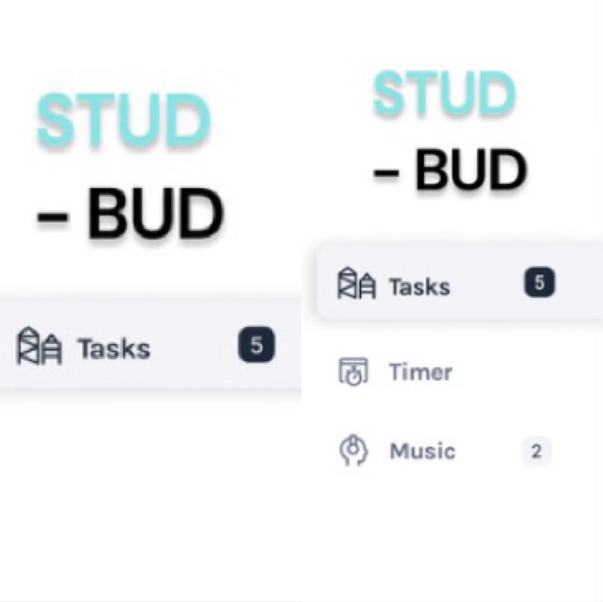
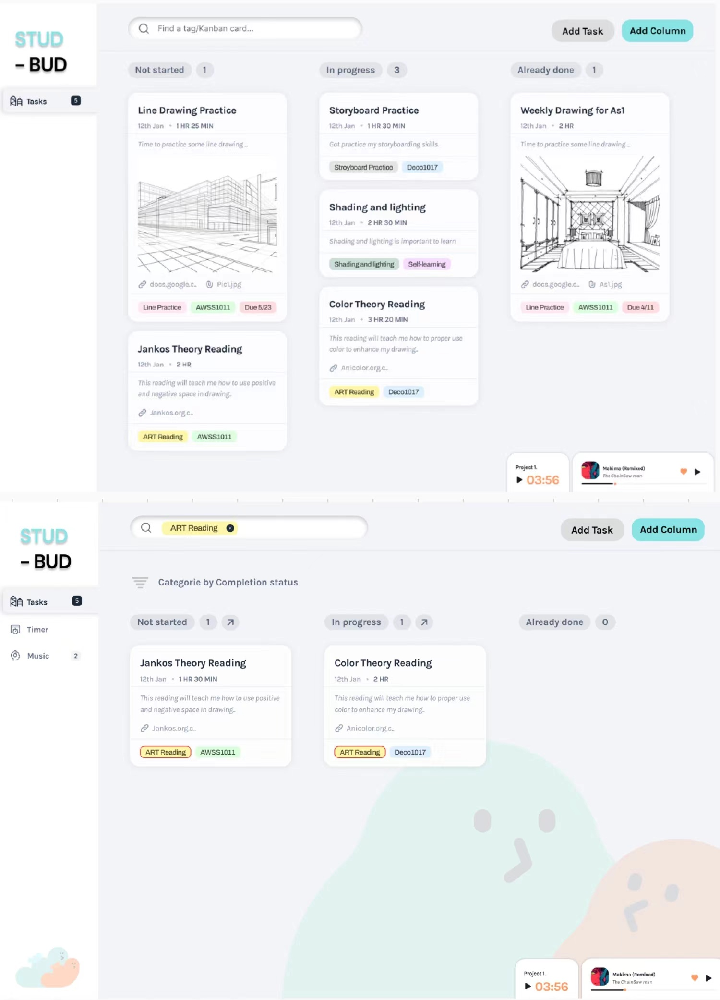
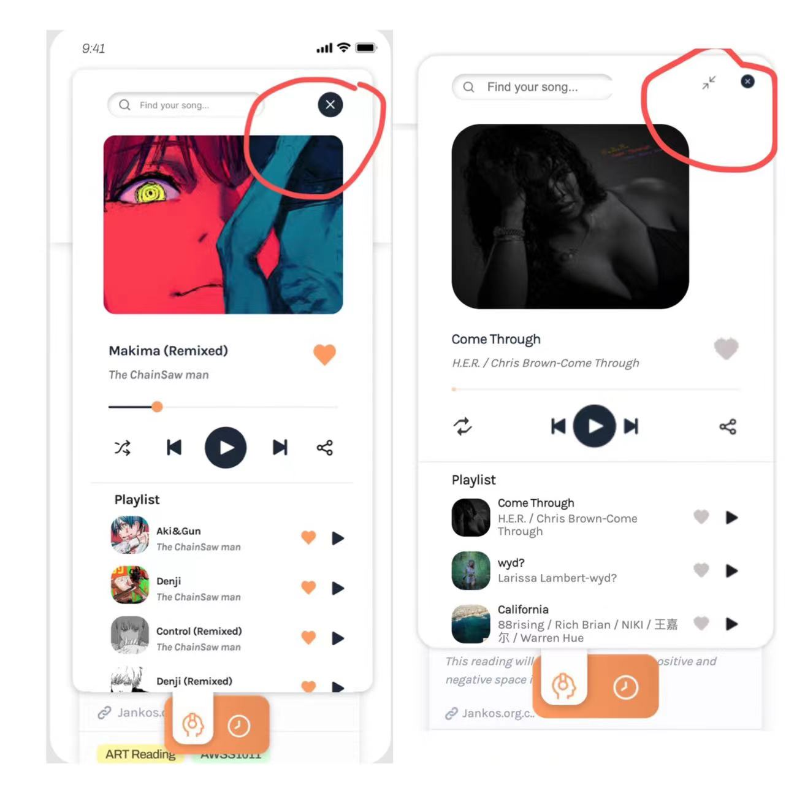

# What is STUD-BUD
> **STUD-BUD**, a web application designed to help students manage their study sessions, especially people who are learning how to draw and sketch.

# Design Principle
>1. The overall page uses a **uniform background, font size, font color and font style** to make the page look more complete.
>2. TThe buttons on the page are dominated by **square and rounded corners**, which look more friendly and comfortable.
>3. The layout of the whole page is **clean and easy to understand**, which is convenient for people to use.
>4. Some buttons in the web page are **brightened with bright colors**to attract eyeballs.

# Iteration

 

>**The navigation bar is more complete.**

>The previous navigation bar design has only one task section, and after iteration, **music and timer are added**. The navigation sidebar can navigate to all the main parts of the app, and the pop-up stopwatch and music player are at the right bottom of the app, which can be expanded and collapsed when in use.

 
>**The overall background adds pattern.**

>The original background used a **solid color**, and after the iteration, some **cute patterns** was added to the background. I think this can attract more students to use it.

 
>**The mobile version of the music interface has added a minimize button.**

>The previous music interface design had only one **close button**, and after the iteration, a **minimized button** was added. This makes it convenient for users to minimize music and switch functions.

# Reference

Beautiful Free Images & Pictures | Unsplash. Retrieved 1 June 2022, from https://unsplash.com

Freepik | Graphic Resources for everyone. Retrieved 1 June 2022, from https://www.freepik.com

Latest tracks | Epidemic Sound. Retrieved 1 June 2022, from https://www.epidemicsound.com

Royalty Free Music by Bensound - Hear the difference. Retrieved 1 June 2022, from https://www.bensound.com/royalty-free-music/2

Figma. Retrieved 1 June 2022, from https://www.figma.com/files/recent?fuid=1104365857031604837
